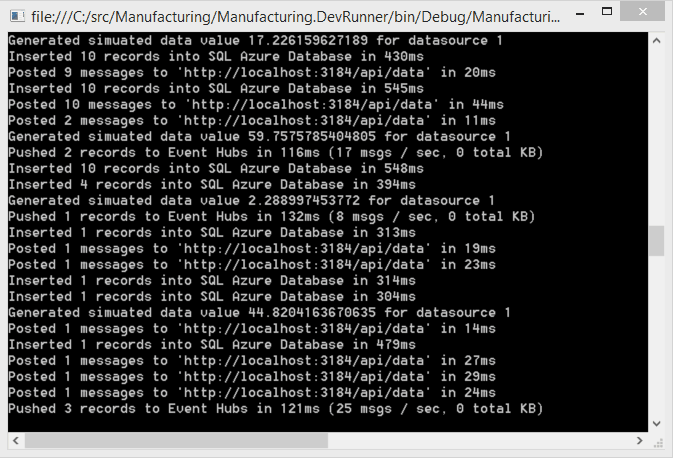
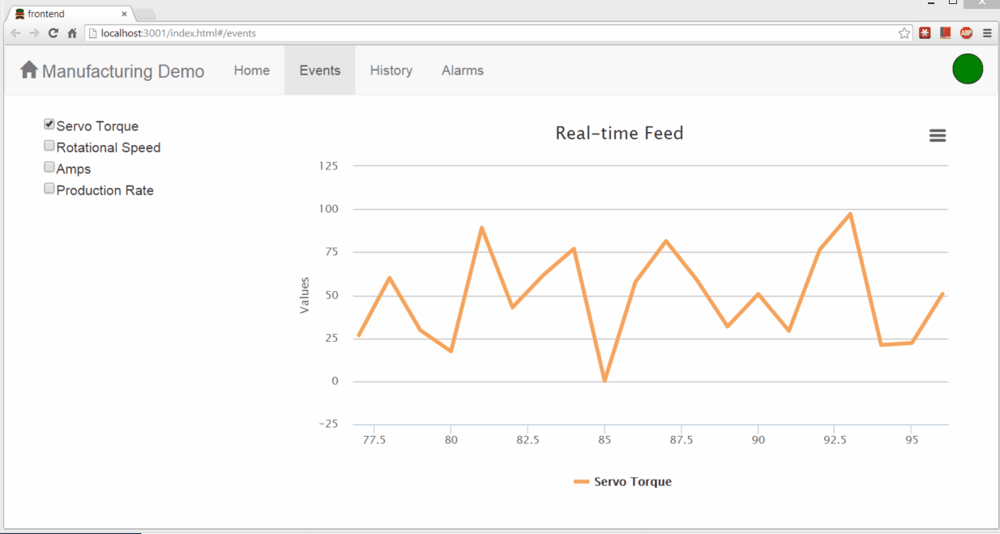

Manufacturing.Web
=======================

An Angular.js application that interfaces with the manufacturing API via REST and SignalR to interact with the system.

Real-time data pushed to Event Hubs can be displayed through this web project.

### Install

1. Open a git/poshgit command prompt in the project directory
1. Run `npm install`
	* Note: If you receive an error that looks like `Error: ENOENT, stat 'c:\users\you\AppData\Roaming\npm`, you should create that folder manually and make sure it's in your path.
1. Run `npm install -g bower`
1. Run `bower install`
1. Run `npm install gulp -g`
1. Modify the server URL in `/src/app/history/history.controller.js`
1. Verify the URL in `/src/app/manufacturingWeb.js` points to a valid, running server. The serve is located in the [Manufacturing.Api](https://github.com/ytechie/Manufacturing.Api) repository.

### Troubleshooting

I've found that npm global installs can fail when installed with Chocolatey. My solution was to uninstall them with Chocolatey, and clean up the exe's in `C:\ProgramData\chocolatey\bin`. Then, install Node with the [standard installer](http://nodejs.org/).

### Running

From a command line in the folder where this project resides, run `gulp serve` to run.

# License

Microsoft Developer Experience & Evangelism

Copyright (c) Microsoft Corporation. All rights reserved.

THIS CODE AND INFORMATION ARE PROVIDED "AS IS" WITHOUT WARRANTY OF ANY KIND, EITHER EXPRESSED OR IMPLIED, INCLUDING BUT NOT LIMITED TO THE IMPLIED WARRANTIES OF MERCHANTABILITY AND/OR FITNESS FOR A PARTICULAR PURPOSE.

The example companies, organizations, products, domain names, e-mail addresses, logos, people, places, and events depicted herein are fictitious. No association with any real company, organization, product, domain name, email address, logo, person, places, or events is intended or should be inferred.
