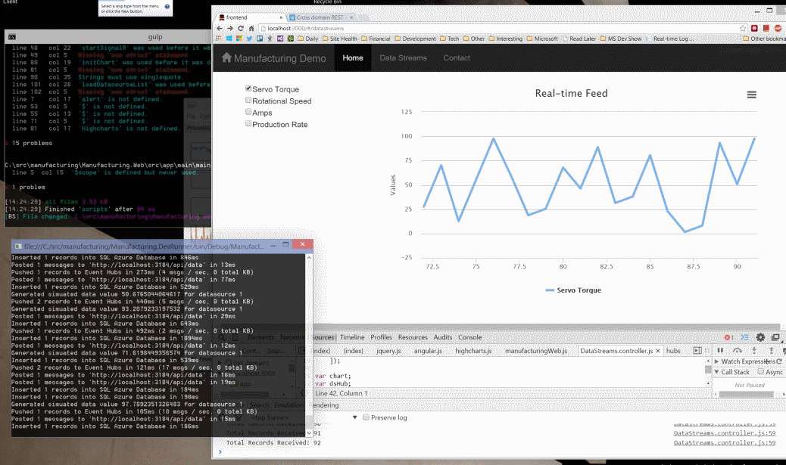

Manufacturing.Web
=======================

An Angular.js application that interfaces with the manufacturing API via REST and SignalR to interact with the system.

### Install

1. Open a git/poshgit command prompt in the project directory
1. Run `npm install`
1. Run `bower install`
1. Modify the server URL in `/src/app/history/history.controller.js`
1. Modify the server URL in `/src/app/liveServer.js`

### Running

From a command line in the folder where this project resides, run `gulp serve` to run.

# License

Microsoft Developer Experience & Evangelism

Copyright (c) Microsoft Corporation. All rights reserved.

THIS CODE AND INFORMATION ARE PROVIDED "AS IS" WITHOUT WARRANTY OF ANY KIND, EITHER EXPRESSED OR IMPLIED, INCLUDING BUT NOT LIMITED TO THE IMPLIED WARRANTIES OF MERCHANTABILITY AND/OR FITNESS FOR A PARTICULAR PURPOSE.

The example companies, organizations, products, domain names, e-mail addresses, logos, people, places, and events depicted herein are fictitious. No association with any real company, organization, product, domain name, email address, logo, person, places, or events is intended or should be inferred.
